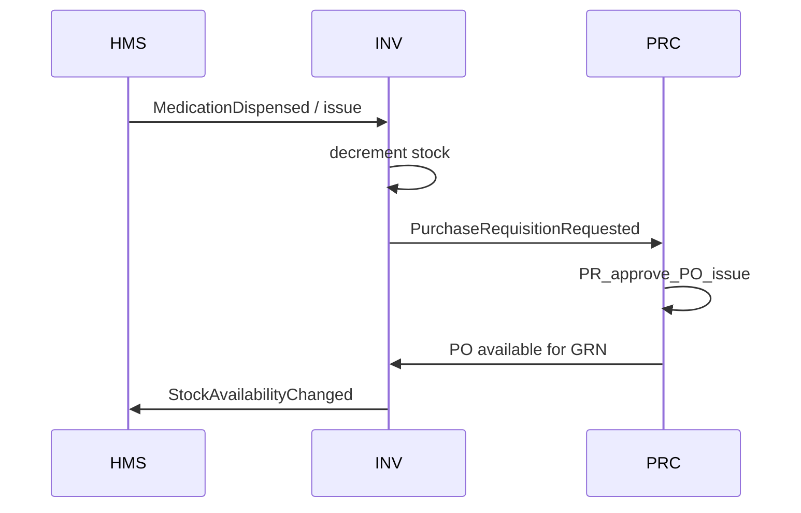

# Medication Order to Stock Replenishment Loop

| Field | Value |
|---|---|
| Module | XWF |
| Sub-module | MED |
| Status | Draft — pending verification |
| Source | §8 primary loop; §3.3; §6.3; §7.3 |

## 1. Scope
Choreograph clinician medication order through dispense, stock decrement, reorder breach, PO, GRN, and restored availability in HMS.

## 2. Exclusions
Non-medication consumable variants are analogous but may skip pharmacist verify.

## 3. Actors and Permissions
- Clinician
- Pharmacist
- Store
- Buyer
- AP (later)

## 4. Functional Requirements
| ID | Requirement |
|---|---|
| XWF-MED-FR-001 | On MedicationDispensed, Inventory shall decrement stock atomically with event processing and publish StockAvailabilityChanged. |
| XWF-MED-FR-002 | When availability breaches reorder point, Inventory shall emit PurchaseRequisitionRequested exactly once per open coverage window. |
| XWF-MED-FR-003 | Procurement shall create/submit PR and progress to PO issue. |
| XWF-MED-FR-004 | On GoodsReceived acceptance, Inventory shall increase stock and publish availability for HMS pharmacy allocation. |
| XWF-MED-FR-005 | HMS shall reflect non-available drugs as blocked/alerted at verify/dispense time. |

## 5. Workflow and State Transitions

## 6. Data / Entities and Validation
- Correlation via patientId/orderId/itemId/storeId
- signalId for reorder dedupe

## 7. Business Rules
| ID | Rule |
|---|---|
| XWF-MED-BR-001 | At-least-once events must not double-decrement stock. |
| XWF-MED-BR-002 | FEFO allocation remains enforced. |

## 8. Approvals
PO approvals as per PRC policies.

## 9. APIs and Module Ownership
**Owner:** XWF

### APIs
- `N/A — choreography of existing APIs`

### Events Published
- `MedicationDispensed`
- `StockAvailabilityChanged`
- `PurchaseRequisitionRequested`
- `PurchaseOrderIssued`
- `GoodsReceived`

### Events Consumed
- `All of the above across modules`

## 10. Notifications
- Stock-out to clinician
- Reorder to buyer

## 11. Reports
- Loop cycle time item replenishment

## 12. Audit, Retention, and Privacy
Full audit across dispense and stock docs.

## 13. Failure, Idempotency, and Concurrency
- Compensating return if dispense voided
- Inbox dedupe
- Stock qty check constraints

## 14. Non-Functional Requirements
- End-to-end lag targets documented per hop (<5s event hops)

## 15. Dependencies
- HMS PHX
- INV
- PRC

## 16. Acceptance Criteria
| ID | Criterion |
|---|---|
| XWF-MED-AC-001 | Dispense reduces stock. |
| XWF-MED-AC-002 | Reorder creates one PR. |
| XWF-MED-AC-003 | GRN restores availability for subsequent dispense. |

## 17. Open Assumptions
- Auto-PO without approval never allowed when thresholds require approval.

## 18. Source Traceability
Mapped from `§8 primary loop; §3.3; §6.3; §7.3` in `Healthcare-ERP-Pathway-and-Workflow.md`.
