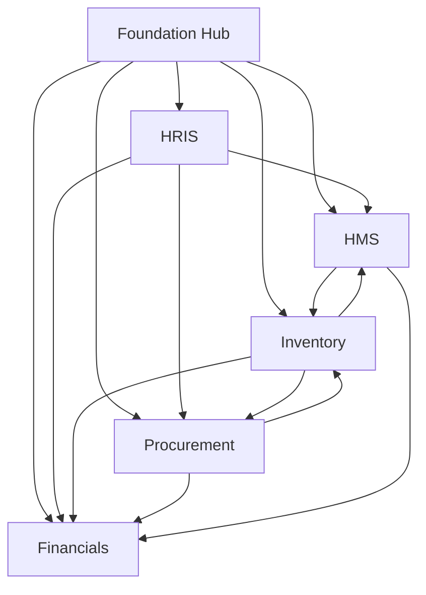

# Healthcare ERP — Requirements Library

This library expands [`Healthcare-ERP-Pathway-and-Workflow.md`](../../Healthcare-ERP-Pathway-and-Workflow.md) into complete, implementable requirements for a **.NET 10 + React/TypeScript + PostgreSQL modular monolith**.

## Approved Delivery Baseline
| Decision | Choice |
|---|---|
| Requirements structure | One folder per major module + separate sub-module files |
| Stack | .NET 10 API, React/TypeScript SPA, PostgreSQL |
| Architecture | Modular monolith with domain events and strict module boundaries |
| Build style | Approval-gated increments |

## Requirement ID Convention
Format: `{MODULE}-{SUB}-TYPE-{NNN}`

| Segment | Meaning | Examples |
|---|---|---|
| MODULE | Major module | `FND`, `HMS`, `HRIS`, `FIN`, `INV`, `PRC`, `XWF` |
| SUB | Sub-module code | `PAT`, `OPD`, `GL`, `PO` |
| TYPE | Requirement type | `FR` functional, `BR` business rule, `AC` acceptance, `NFR` non-functional, `EVT` event |
| NNN | Zero-padded sequence | `001` |

## Module Map
| Folder | Module | Owns |
|---|---|---|
| [00-foundation](00-foundation/) | Integration hub & platform services | Tenancy, identity/RBAC, approvals engine, audit, notifications, documents, events, reporting contracts, data governance |
| [01-hms](01-hms/) | Hospital Management System | Patient master, encounters, clinical orders, diagnostics, pharmacy dispense (clinical), billing initiation, EMR |
| [02-hris](02-hris/) | Human Resource Information System | Employee master, credentials, roster, leave, payroll inputs, org hierarchy |
| [03-financials](03-financials/) | Financials | Chart of accounts, cost centers, GL, AP, AR, assets, cash/bank, tax, MIS |
| [04-inventory](04-inventory/) | Store & Spares | Item/SKU master, stores/bins, stock, batch/expiry, issues, transfers, counts |
| [05-procurement](05-procurement/) | Procurement | Vendor master, requisitions, RFQ, contracts, POs, vendor performance |
| [06-cross-module-workflows](06-cross-module-workflows/) | Cross-module pathways | End-to-end event choreography and reconciliation |

## Dependency Map

## Implementation Phasing (from blueprint §10)
1. **Phase 1 — Foundations**: master data, Foundation hub, core HMS (registration/OPD/billing), core Financials (GL/AP/AR).
2. **Phase 2 — Operations**: IPD, pharmacy, lab/radiology, Inventory, Procurement.
3. **Phase 3 — Workforce**: full HRIS integrated with HMS scheduling.
4. **Phase 4 — Optimization**: budgeting, analytics, portals, advanced MIS.

## Traceability Register
See [TRACEABILITY.md](TRACEABILITY.md) for requirement → design → code → test linkage.

## Verification Package
See [VERIFICATION.md](VERIFICATION.md) for consistency checks, file inventory, and open assumptions awaiting approval.

## Glossary
| Term | Definition |
|---|---|
| Integration hub | Shared Foundation services and master-data contracts used by all modules |
| Modular monolith | Single deployable solution with enforced module boundaries |
| Outbox/Inbox | Reliable messaging pattern for cross-module events |
| GRN | Goods Receipt Note |
| Three-way match | Matching PO, GRN, and vendor invoice before AP payment |
| FEFO | First-Expiry-First-Out stock issue rule |
| MAR | Medication Administration Record |
| TPA | Third-Party Administrator (insurance) |
| CME | Continuing Medical Education |
| Cost center | Financial responsibility unit (ward/department/equipment category) |
| Credential gate | HRIS check that blocks clinical actions when license/privilege is invalid |

## How to Review
1. Read this index and the Foundation overview first.
2. Review each module overview, then its sub-module files.
3. Review cross-module workflows.
4. Confirm or amend open assumptions in [VERIFICATION.md](VERIFICATION.md).
5. Approve the package before any application scaffolding begins.
